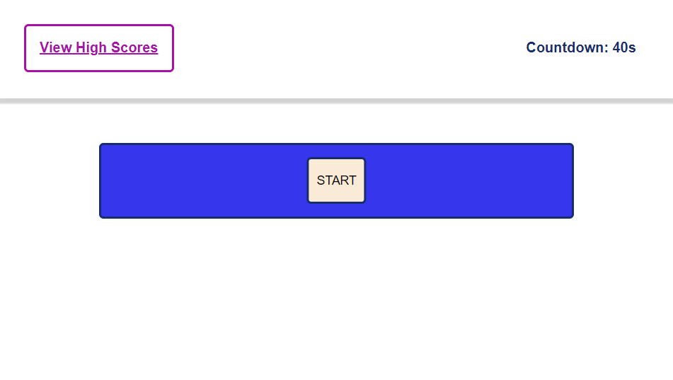
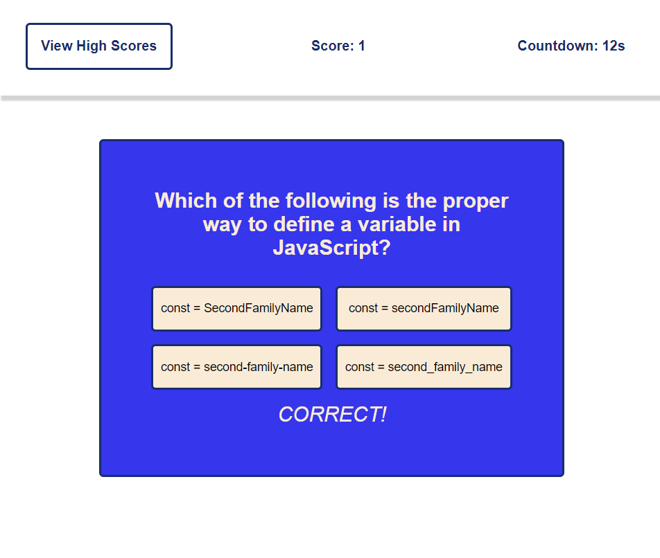

# Module-4-Ishan-Wijesingha

## Link to deployed application
https://ishan-wijesingha99.github.io/JavaScript-Quiz-App/

## Description
This application is a 15 question quiz on JavaScript. Once the start button is pressed, a Question as well as four options are displayed for the user, a timer of 40 seconds also starts.
Once the user presses on one of these buttons, the next question will be displayed, as well as a text element that informs the user whether they got the previous question correct or wrong. 
Every time a user gets a question wrong, the timer decreases by 10 seconds. This process continues until the user finishes answering all 15 questions or the timer ends. 
Once the quiz ends, users can record their high score under their initials. 
Users can presses a button on the top-left of the screen to access the top 3 high scores recorded since the application first loaded.

## Screenshot of application

